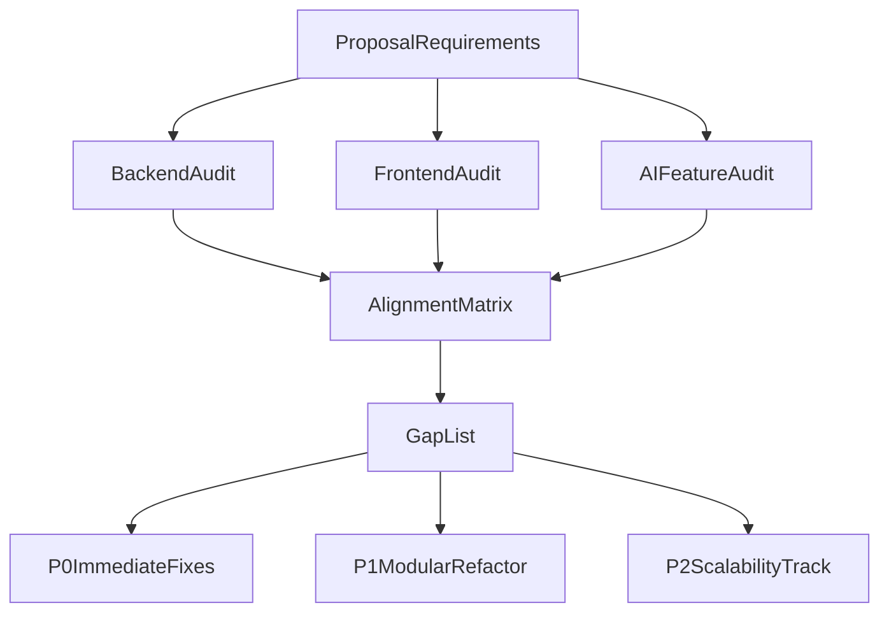

# EscrowIQ Proposal Alignment Review

## Scope and Method
This review compares the current implementation against the submitted EscrowIQ proposal across backend, frontend, AI features, and scalability readiness.

Primary evidence reviewed:
- `C:/WP Project/Backend/app.py`
- `C:/WP Project/Backend/run.py`
- `C:/WP Project/Frontend/templates/base.html`
- `C:/WP Project/Frontend/templates/index.html`
- `C:/WP Project/Frontend/templates/dashboard_client.html`
- `C:/WP Project/Frontend/templates/job_detail.html`
- `C:/WP Project/Frontend/templates/profile.html`
- `C:/WP Project/Frontend/templates/login.html`

---

## Executive Verdict
The project is **functionally aligned** with many core proposal goals (role-based users, jobs, proposals, escrow simulation, fraud scoring, matching, proposal generation). With Flask treated as the intentional backend choice, the main gaps are implementation consistency, architecture hardening, and scale readiness.

Overall status: **Partially aligned**.

---

## Architecture Snapshot



Current architecture in code:
- Single-file backend monolith in `app.py` (routes + DB + business logic + AI logic in one place).
- Server-rendered Jinja templates in `Frontend/templates`.
- SQLite database with raw SQL.
- No test suite, no dependency manifest, no deployment artifacts.

---

## Proposal Alignment Matrix

| Proposal Area | Status | Evidence in Code | Notes |
|---|---|---|---|
| User registration/login | Aligned | `api_register`, `api_login`, `api_logout` in `app.py` | Password hashing and role handling exist. |
| Role-based access (Client/Freelancer) | Aligned | Role checks in APIs and dashboards in `app.py` + templates | Both role flows are present. |
| Job posting and browsing | Aligned | `api_post_job`, `jobs_page`, `dashboard_*` templates | Core lifecycle exists. |
| Proposal submission and review | Aligned | `api_submit_proposal`, accept/reject APIs, `job_detail.html` | One proposal per freelancer/job enforced. |
| Escrow payment simulation | Aligned | `api_escrow_deposit`, `release`, `refund` in `app.py` | Deposit/release/refund simulation works. |
| AI fraud detection | Aligned | `analyze_fraud`, `FRAUD_RULES`, fraud fields in `jobs` | Rule-based risk scoring implemented. |
| AI smart matching | Aligned | `match_freelancers`, `/api/ai/match-freelancers/<job_id>` | Weighted scoring implemented. |
| AI proposal generation | Aligned | `generate_proposal`, `/api/ai/generate-proposal` | Template-driven generator exists. |
| Transparent risk indicators | Aligned | Fraud badge/reasons in `job_detail.html` and post-job response | Visible and actionable. |
| Flask backend stack (updated scope) | Aligned | Flask app and API routes implemented in `app.py` | Backend is intentionally Flask-based. |
| HTML/CSS/JS frontend | Aligned | Template UI and embedded JS in `Frontend/templates/*.html` | Fully server-rendered HTML/CSS/JS stack. |
| Testing and module validation | Not aligned | No test files discovered | Proposal expects module testing. |
| Scalable backend architecture | Partially aligned | Basic WAL + role checks; monolith + SQLite remain | Works for demo, not for scale. |

---

## Backend Findings

### What aligns well
- End-to-end marketplace core: users, jobs, proposals, escrow, notifications are implemented in DB schema (`init_db` in `app.py`).
- AI-inspired logic exists in code and is integrated into product flow:
  - Fraud detection during job posting.
  - Smart freelancer matching for client-side decision support.
  - Proposal draft generation for freelancers.
- Session auth and route-level authorization are present.

### What needs improvement
1. **Monolithic backend design**
   - `app.py` contains schema, utility functions, auth, APIs, AI, and routing.
   - Impact: hard to scale team development and safely evolve features.

2. **Weak transactional guarantees around financial operations**
   - Escrow and job/proposal state transitions occur through multiple independent writes.
   - Impact: race-condition/inconsistent-state risk under concurrency.

3. **Missing security controls for production**
   - Hardcoded fallback secret key.
   - No visible CSRF strategy for state-changing session-auth requests.

4. **No tests**
   - No automated verification for critical trust/payment flows.

---

## Frontend Findings

### What aligns well
- Strong role-based UX with dedicated pages and workflows.
- Major proposal functions are accessible from UI:
  - Client: post jobs, review proposals, fund/release/refund escrow.
  - Freelancer: browse jobs, submit proposals, use AI proposal generation.
- Clear trust-oriented communication (risk badges, escrow states, stats).

### What needs improvement
1. **Template folder mismatch risk**
   - `app.py` points `template_folder` to `Backend/templates`, but templates are in `Frontend/templates`.
   - Impact: deployment/runtime fragility.

2. **Template/data contract mismatches**
   - `index.html` loops over `open_jobs` while backend sends `open_jobs` count.
   - `dashboard_client.html` and `job_detail.html` use `job.proposal_count`, but corresponding backend queries do not populate this field.
   - `profile.html` expects `recent_jobs`/`recent_proposals`, but `profile_page` sends only `user`.
   - `login.html` displays `data.username`; `api_login` does not return username.
   - `base.html` expects `data.unread`; notifications API returns only `notifications`.
   - Impact: rendering errors, broken badges/counters, inconsistent UX.

3. **Claims vs implementation drift**
   - Landing page claims top 6 matches; matching returns top 5.
   - "Real-time notifications" claim is stronger than implementation (fetch-based, not push).

---

## AI Feature Alignment

### Fraud detection
- Implemented via rule engine with weighted regex patterns and quality checks.
- Produces score and level (`Low`/`Medium`/`High`) and stores reasons.
- **Alignment:** Good for proposal scope (academic/project simulation).

### Smart matching
- Implements normalized skills + synonym mapping + weighted composite score.
- Returns matched skill details and ranking.
- **Alignment:** Good, but should add explainability and performance optimizations at scale.

### Proposal generator
- Generates style-based, contextual draft text.
- **Alignment:** Good for initial proposal objective.

### AI maturity note
- Current implementation is deterministic/rule-based heuristics (which is acceptable per proposal language), but not model-backed ML/LLM workflows yet.

---

## Scalability Readiness Review

### Strengths
- Simple architecture suitable for an academic prototype.
- Basic database pragmas (`WAL`, foreign keys) and role authorization in place.
- Clear path from user actions to business outcomes.

### Constraints blocking scale
- SQLite write concurrency limits.
- Single-process synchronous app design.
- No caching, queues, background workers, or event-driven notifications.
- No API schema versioning, rate limiting, or documentation.
- No observability stack (metrics/tracing/structured logs).
- No CI/CD and no automated tests.

---

## Prioritized Improvement Roadmap

## P0 - Immediate Stability (1-2 weeks)
- Fix all frontend-backend data contract mismatches:
  - `open_jobs` list vs count issue.
  - missing `proposal_count`.
  - profile recent activity context.
  - login response payload mismatch.
  - notifications unread count mismatch.
- Resolve template/static path consistency between backend config and actual template location.
- Add server-side validation parity for client-side constraints (e.g., proposal minimum length).
- Add basic CSRF protection and remove hardcoded secret fallback in non-dev environments.
- Add smoke tests for critical flows (register/login, post job, submit proposal, escrow release/refund).

## P1 - Structural Refactor (2-6 weeks)
- Split `app.py` into domain modules/blueprints:
  - `auth`, `jobs`, `proposals`, `escrow`, `ai`, `notifications`.
- Introduce service and repository layers for business rules and DB access separation.
- Add migration tooling and reproducible dependencies (`requirements.txt` or `pyproject.toml`).
- Move inline template JS/CSS into versioned static bundles for maintainability.
- Add API contract tests to prevent template/API drift.

## P2 - Scale-Ready Platform (6-12+ weeks)
- Migrate SQLite to PostgreSQL.
- Introduce async workers (Celery/RQ) for notifications, fraud re-analysis, reporting, and future AI tasks.
- Add real-time channel (WebSocket/SSE) for true notification updates.
- Add milestone-based escrow, dispute lifecycle, and audit trails.
- Add observability (structured logging, metrics, tracing) and CI/CD.
- Add rate limiting, API versioning, and formal API docs.

---

## Suggested Next Implementation Sequence
- Complete all P0 fixes first to stabilize correctness and trust.
- Add a minimal automated test suite before major refactoring.
- Start P1 modularization while preserving existing endpoints to avoid breaking UI.
- Continue with Flask and invest in modular architecture, test coverage, and production operations before P2 investments.

---

## Detailed Guide: Upgrading to Model-Backed AI

This section explains how to evolve the current rule/template AI into a model-backed system while keeping your existing Flask application stable.

### 1) Decide model-backed targets first
- Keep current rules as fallback.
- Upgrade these three capabilities first:
  - Fraud detection: heuristic + model risk classifier.
  - Smart matching: semantic relevance + ranking model.
  - Proposal generation: LLM-generated draft with guardrails.

### 2) Introduce an AI service layer in backend
- In Flask, separate AI logic from routes:
  - `services/ai/fraud_service.py`
  - `services/ai/matching_service.py`
  - `services/ai/proposal_service.py`
  - `services/ai/provider.py` (model client abstraction)
- Keep route handlers thin; route calls service; service returns structured output.

Suggested contract shape:
```python
{
  "source": "rule_based|model|hybrid",
  "version": "v1",
  "score": 0.0,
  "label": "Low|Medium|High",
  "reasons": [],
  "latency_ms": 0
}
```

### 3) Build a provider abstraction (do not couple routes to one model)
- Add a single provider interface:
  - `analyze_fraud(text) -> result`
  - `rank_matches(job, freelancers) -> list`
  - `generate_proposal(job, freelancer, style) -> text`
- Implement feature flags per endpoint:
  - `AI_MODE=rules|model|hybrid`
  - `AI_FALLBACK_ENABLED=true`
- If model call fails, fallback to current rules/templates.

### 4) Data preparation and storage upgrades
- Add tables for model operations:
  - `ai_inference_logs` (input hash, model name, output label/score, latency, timestamp).
  - `ai_feedback` (user correction, accepted/rejected suggestion, quality rating).
- Store only minimal, safe payloads; avoid sensitive raw text where unnecessary.
- Add versioning fields:
  - `fraud_model_version`
  - `matching_model_version`
  - `proposal_model_version`

### 5) Fraud detection migration pattern (hybrid)
1. Keep existing regex score as baseline.
2. Add model inference score (0-1).
3. Blend both:
   - `final_score = 0.4 * rule_score_norm + 0.6 * model_score`
4. Convert final score to `Low/Medium/High` thresholds.
5. Save both components for explainability.

This gives trust + explainability while gradually improving precision.

### 6) Smart matching migration pattern
- Current matching is keyword/synonym based.
- Model-backed upgrade:
  1. Generate embeddings for job and freelancer profiles.
  2. Compute semantic similarity.
  3. Blend with rating/reviews/business constraints.
- Formula example:
  - `final_rank = 0.55*semantic + 0.25*skill_overlap + 0.15*rating_norm + 0.05*experience_norm`
- Precompute freelancer embeddings on profile update to reduce runtime latency.

### 7) Proposal generation migration pattern
- Use an LLM prompt with strict structure:
  - Inputs: job title, job scope summary, required skills, freelancer skills, tone.
  - Output schema: greeting, fit summary, approach, timeline statement, close.
- Add guardrails:
  - Max length.
  - No guarantees/fake claims.
  - No off-platform payment suggestions.
- Run output post-processing:
  - profanity/safety check.
  - minimum quality check (length and section completeness).

### 8) Prompt and output safety controls
- Maintain prompt templates in versioned files.
- Add input sanitization for user-generated text.
- Add output validation:
  - JSON schema for structured tasks.
  - reject and regenerate on invalid format.
- Add policy filters before storing/displaying generated text.

### 9) Async architecture for scale
- Do not run all model calls inline at high traffic.
- Introduce queue/worker flow:
  - Request arrives -> enqueue AI task -> worker infers -> store result -> notify UI.
- Keep synchronous mode only for low-latency actions (proposal drafting with timeout + fallback).

### 10) Observability and quality measurement
- Track per-feature metrics:
  - latency p50/p95
  - error/fallback rate
  - user acceptance rate
  - fraud false positive/false negative feedback
- Add dashboard alerts:
  - sudden latency spikes
  - rising fallback ratio
  - model drift indicators

### 11) Rollout strategy (safe deployment)
- Phase A: shadow mode
  - model runs in background, users still see rule-based result.
  - compare outputs offline.
- Phase B: hybrid mode
  - expose model-assisted results to a small percentage of traffic.
- Phase C: primary mode
  - model output primary, rules as fallback and safety net.

### 12) Suggested implementation timeline

#### Week 1-2: Foundations
- Create AI service layer and provider abstraction.
- Add config flags and fallback strategy.
- Add inference logging tables.

#### Week 3-4: Fraud model hybrid
- Integrate model scoring.
- Blend with existing rules.
- Add explanation UI fields.

#### Week 5-6: Matching model
- Add embeddings pipeline and rank blending.
- Precompute freelancer embeddings.

#### Week 7-8: Proposal model
- Add LLM generation with guardrails and validation.
- Add user feedback capture ("useful/not useful").

#### Week 9+: Production hardening
- Queue workers, caching, monitoring, A/B testing.
- Retraining loop from feedback data.

### 13) Practical first steps for your current codebase
- Keep routes unchanged for now:
  - `/api/ai/generate-proposal`
  - `/api/ai/match-freelancers/<job_id>`
  - fraud logic in `/api/jobs`
- Replace internal function calls with service calls.
- Add feature flag defaulting to current behavior:
  - start with `AI_MODE=rules`.
- Turn on `hybrid` only after basic metrics are visible.

---

## Final Assessment
EscrowIQ currently demonstrates a strong functional prototype aligned with the product vision, especially around trust features and AI-assisted workflows. With Flask as the chosen stack, the path forward is clear: stabilize contracts, modularize backend services, add tests/operations, and evolve AI features through a hybrid-to-model-backed rollout.
